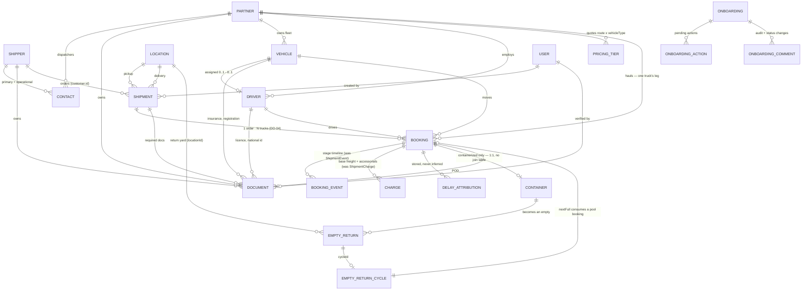
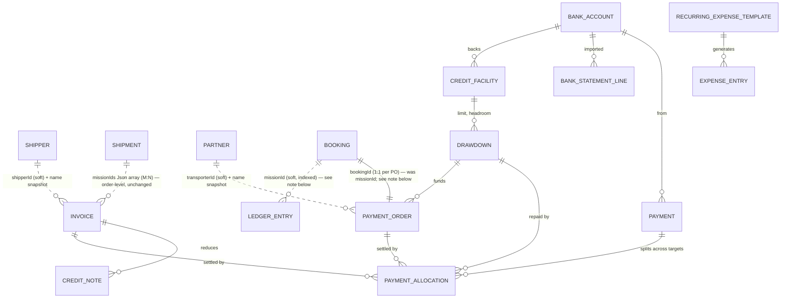
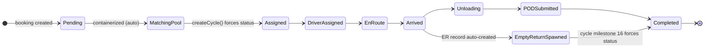
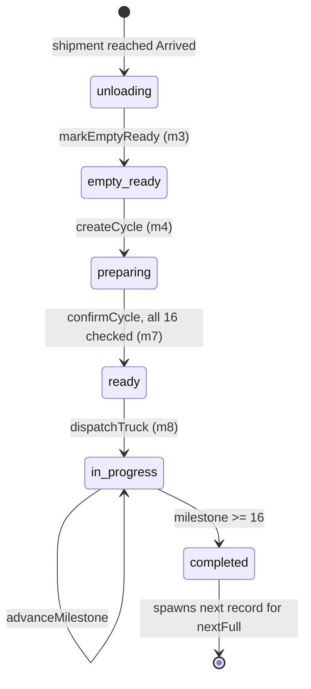

# FLEETIN — Entity Relationship Diagram

**Phase 2 analysis, revised in Phase 2.1. Proposed, not implemented. No Prisma models created.**

Every relationship is annotated with the evidence that supports it. Anything not supported by code is marked **⚠️ DD-nn** and appears in `DOMAIN_DECISIONS_FINAL.md` — it is not drawn as fact.

> **Phase 2.1 change (DD-04 / DD-03):** `Shipment` is now the commercial order and `Booking` is the per-truck/per-container execution unit beneath it. Everything that used to hang directly off `Shipment` at execution grain — driver, vehicle, container, event timeline, charges, delay attribution — now hangs off `Booking` instead. Full reasoning in `DOMAIN_DECISIONS_FINAL.md` DD-04/DD-03; the database shape is in `DATABASE_BLUEPRINT.md` §4–5.

---

## 1. Full operational map



---

## 2. Finance integration — soft references only

The existing finance models reference the operational domain through **unconstrained string ids paired with denormalised name snapshots**. There are no foreign keys, and that is deliberate (BR-5.2: an issued invoice must not change when a partner is renamed).



### Confirmed integration points

| Finance field | Points at | Type | Evidence |
|---|---|---|---|
| `Invoice.shipperId` + `shipperName`/`shipperCompany` | Shipper | soft id + snapshot | `prisma/schema.prisma` |
| `Invoice.missionIds` (**Json array**) | Shipment (order) | **many-to-many** — unchanged by DD-04; a shipper is billed at the order level, possibly bundling several orders in one invoice | `Invoice.missionIds: Json` |
| `InvoiceLineItem.missionId` **and** `.bookingId` | Shipment **and** Booking | **now two real FKs, not one field read two ways** — see note below | `types/finance.ts` |
| `PaymentOrder.transporterId` + names | Partner | soft id + snapshot | schema |
| `PaymentOrder.missionId` → **should become `PaymentOrder.bookingId`** | Booking | **one PO per booking, not per order** — you pay one carrier for one truck's work; a multi-truck, multi-carrier shipment needs several POs, which the old 1:1-per-mission shape could not express | schema + DD-04 |
| `PaymentOrder.driverName`, `assignedTruckPlate`, `route` | Driver / Vehicle | **name/plate snapshot only, no id** — now naturally sourced from the Booking these fields already describe | schema |
| `LedgerEntry.missionId` (indexed, nullable) | Shipment **or** Booking | denormalised for per-mission P&L without joins — **ambiguous post-DD-04**, see note below | schema |
| `LedgerEntry.counterpartyType` + `counterpartyId` | polymorphic | `SHIPPER\|TRANSPORTER\|BANK\|EMPLOYEE\|VENDOR` | schema |
| `Payment.counterpartyType` + `counterpartyId` | polymorphic | same | schema |
| `PaymentAllocation.targetType` + `targetId` | polymorphic | `INVOICE\|PAYMENT_ORDER\|DRAWDOWN` | schema |
| `ExpenseEntry.paidById` (`emp-01`) | Employee | **table does not exist** | `financeMockData.ts` |
| `*.createdById` / `approvedById` | User | four-eyes audit | schema |

**Note on `InvoiceLineItem` — DD-04 resolves a small existing puzzle.** The
field carried both `missionId` and `bookingId` before Phase 2.1 could explain
why: they were never redundant, they were two identifiers for the same
Mission row, because Booking didn't exist yet as a separate entity. Now they
are exactly what the field names always suggested — `missionId` → `Shipment.id`
(which order this line bills), `bookingId` → `Booking.id` (which truck's leg).

**Note on `LedgerEntry.missionId` — flagged, not resolved.** A ledger entry
for `PAYMENT_MADE` (paying a carrier) is naturally a **Booking** fact; one for
`INVOICE_ISSUED` or `PAYMENT_RECEIVED` (billing the shipper) is naturally a
**Shipment** fact. The single `missionId` column cannot be both without an
application-level convention for which it means per row. This phase does
**not** touch the finance schema, so the fix — most likely splitting into
`shipmentId` + optional `bookingId`, or keeping `missionId` as a polymorphic
pointer resolved via `sourceType` — is deferred to when finance's own
migration is written, alongside DD-09 (drawdown backing invoices).

### Two polymorphic patterns must be modelled explicitly

1. `LedgerEntry.{counterpartyType, counterpartyId}` **and** `{sourceType, sourceId}`
2. `PaymentAllocation.{targetType, targetId}`

Prisma cannot express these as relations. They stay as typed string pairs with application-level integrity, exactly as they are now.

### Relationships that are **NOT** evidenced

- `Drawdown.backingInvoiceIds[]` exists in the **TypeScript** type but **not** in the Prisma schema. The `DrawdownExposureStatus` rule (BR-5.12) depends on it. → **DD-09**
- Nothing links `ExpenseEntry.paidById` to any table.
- No link exists between `EmptyReturnRecord` and any finance record — detention/demurrage costs are computed in BI but never posted to the ledger. → **DD-14**

---

## 3. Cardinality register

| Relationship | Cardinality | Optional? | Evidence |
|---|---|---|---|
| Shipper → Shipment | 1 : N | required | `Mission.customer.id` |
| **Shipment → Booking** | **1 : N** | required, ≥1 | ⚠️ **new — DD-04.** `vehiclesNeeded = containerQuantity`; a shipment needs as many bookings as it needs trucks |
| Partner → Booking | 1 : N | required | ⚠️ **was Partner → Shipment.** `transporterAssignments[].partnerId` — one carrier per truck, several carriers possible per order |
| Partner → Vehicle | 1 : N | required | `PartnerRecord.vehicles[]` |
| Partner → Driver | 1 : N | required | `PartnerRecord.drivers[]` |
| Vehicle ⇄ Driver | **0..1 : 0..1** | both optional | bidirectional `assignedVehicleId` / `assignedDriverId` ⚠️ **DD-06** |
| Booking → Driver | N : 0..1 | optional | ⚠️ **was Shipment → Driver.** `Mission.driver?`, now scoped to the truck it drives |
| Booking → Vehicle | N : 0..1 | optional | ⚠️ **was Shipment → Vehicle.** `Mission.assignedTruck?` |
| Shipment → Location | N : 1 ×2 | required | pickup + delivery, **embedded free text today**; order-level, not per-truck — no evidence of bookings on one order going to different destinations |
| **Booking → Container** | **1 : 0..1** | containerized only | ⚠️ **was Shipment → Container.** One truck moves one box; `containerNumber?` moves down a level |
| Booking → BookingEvent | 1 : N | — | ⚠️ **renamed from Shipment → ShipmentEvent.** BI contract's `Shipment` schema is booking-grain (see DD-03) |
| Booking → Charge | 1 : N | — | ⚠️ **renamed from Shipment → Charge.** Same reason |
| Container → EmptyReturn | 1 : N | over time | one record per return trip |
| EmptyReturn → Cycle | N : 0..1 | null until matched | `cycleId` |
| **Cycle → Booking (nextFull)** | **1 : 0..1** | optional | ⚠️ **was Cycle → Shipment.** `nextFull.shipmentId?` → `nextFull.bookingId?` — the pool holds open bookings, not open orders |
| **EmptyReturn → Booking** | **N : 0..1** | **the only hard FK in that module** | ⚠️ **renamed from `shipmentId?`.** Each booking owns exactly one container, so this is now a precise link instead of an order-level approximation |
| Chain → Cycle | **derived** | — | `GROUP BY chainId` |
| Invoice ⇄ Shipment | **M : N** | — | `missionIds` Json array — **unchanged**, stays order-level |
| **PaymentOrder → Booking** | **1 : 1** | required | ⚠️ **was PaymentOrder → Shipment (`missionId`).** See ERD §2 note — one PO per carrier per truck |
| Partner → PricingTier | 1 : N | optional | `pricingGrid?` |
| Onboarding → Partner/Shipper | **none** | ⚠️ | no FK exists — **DD-08** |
| Document → owner | polymorphic | — | 5 owner types now (adds Booking, for the POD) |

---

## 4. Lifecycle relationships

### 4.1 The Booking ↔ Empty Return loop

This is the system's defining workflow. It is **bidirectional** and currently implemented by two Zustand stores importing each other through `shipmentBridge.ts`. The ladder below is what today's code calls `Mission.status` — per the DD-04/DD-03 resolution, this is **one truck's** progress, so post-resolution it becomes `Booking.status` (recommended vocabulary: the 11-value BI `STAGE_KEYS`, pending final sign-off at **DD-12**). The states are kept in their original names here since that is what the evidence (`NEXT_STATUS` in `MissionRowCard.tsx`) actually shows; `DATABASE_BLUEPRINT.md` §4.2 has the mapping to `STAGE_KEYS`.



**Two edges bypass the linear ladder entirely** (BR-2.3): `createCycle` forces `→ Assigned`, and cycle completion forces `→ Completed`, skipping five intermediate states. Any server-side state machine must permit both or the cycle workflow breaks.

**Shipment-level status is separate and coarser.** `Shipment.status` (the order) is a rollup — `DRAFT|CONFIRMED|IN_PROGRESS|COMPLETED|CANCELLED` — derivable from its bookings' states (e.g. `IN_PROGRESS` while any booking is neither terminal nor cancelled, `COMPLETED` only once every booking is). It does not need its own independent transition guards; the bookings' state machine is authoritative.

### 4.2 Empty Return cycle — one-way, no cancel, no undo



`markStandaloneRequired` sets an exception **without changing status** — it permanently removes the record from matching.

**Every guard above is enforced in a React component today, not in the store** (BR-4.1).

### 4.3 Container chain — the recurring loop

```
Container C ──delivered──► EmptyReturn ER-1 ──cycle CYC-1──► returned
                                │
                                └─ nextFull = Booking B2 (consumed from pool)
                                       │
                                       └──delivered──► EmptyReturn ER-2 ──CYC-2──► …
```

(Was "Shipment S2" prior to DD-04 — the pool always held individual open trucks, this just names it correctly now.)

Cycles join a chain only when **transporter AND location match** and the chain is not fully completed (BR-4.4). `seq` counts completed cycles too, so it climbs across the chain's whole life (BR-4.5).

---

## 5. Ownership and deletion semantics

| Parent | Child | On parent delete | Rationale |
|---|---|---|---|
| Partner | Vehicle, Driver, PricingTier, Contact | **Cascade** | No independent existence |
| Shipper | Contact | Cascade | — |
| **Shipment** | **Booking** | **RESTRICT** | ⚠️ **new.** A booking carries its own payment-order and charge history; an order cannot be hard-deleted out from under trucks that were paid to move it |
| **Booking** | BookingEvent, Charge, DelayAttribution | Cascade | ⚠️ **was Shipment's children.** Facts about that one truck's movement |
| Partner / Shipper | **Shipment** | **RESTRICT** | Financial history must survive |
| Partner | **Booking** | **RESTRICT** | Same reason, one level down |
| Partner / Shipper | **Document** | **Soft delete** | Compliance evidence is auditable |
| EmptyReturn | Cycle | RESTRICT | Cycles are audit records |
| Onboarding | Action, Comment | Cascade | — |
| Anything | **Finance records** | **NEVER** | Append-only ledger |

**Soft delete required on:** Shipper, Partner, Vehicle, Driver, Shipment, **Booking**, Document, Location. Everything financial is append-only and reversed by counter-entry, never deleted.

---

## 6. Identity notes

- Every id in the frontend today is a **display string** (`MSN-2026-8801`, `PTR-001`), not a UUID.
- Phase 1 uses `uuid()` primary keys throughout.
- Recommended: **UUID primary key + a separate human-readable `reference` column** with a real database sequence. This preserves the operator-facing identifiers users already know while fixing the collision-prone generators catalogued in `BUSINESS_RULES.md` §9.
- ⚠️ **Mock ID spaces are not consistent between files** (`SHP-102` is two different companies) — see `DOMAIN_MAP.md` §5.1 and **DD-11**. Do not treat them as foreign keys during seeding.
- **`Booking.externalReference`** (new, DD-04) is where the DPCS booking numbers that used to be joined into one lossy `Mission.bookingId` string now live — one clean value per row instead of `"1173, 1174, 1175"` on a single shipment.

---

## 7. Legend

| Notation | Meaning |
|---|---|
| `\|\|--o{` | one-to-many, mandatory parent |
| `\|\|--o\|` | one-to-zero-or-one |
| `\|\|..o{` | **soft reference** — string id, no FK constraint |
| `}o--o{` | many-to-many |
| ⚠️ DD-nn | unresolved (or, where marked "resolved", the change that resolution produced); see `DOMAIN_DECISIONS_FINAL.md` |
